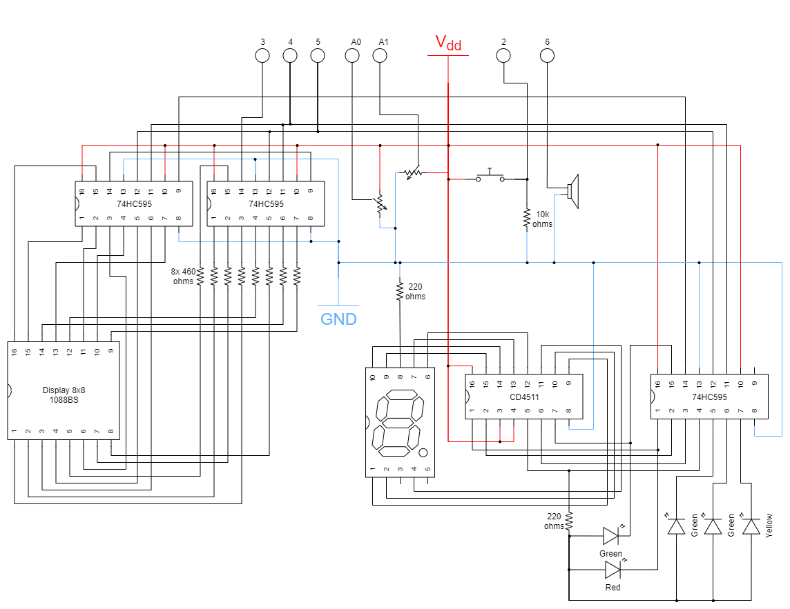
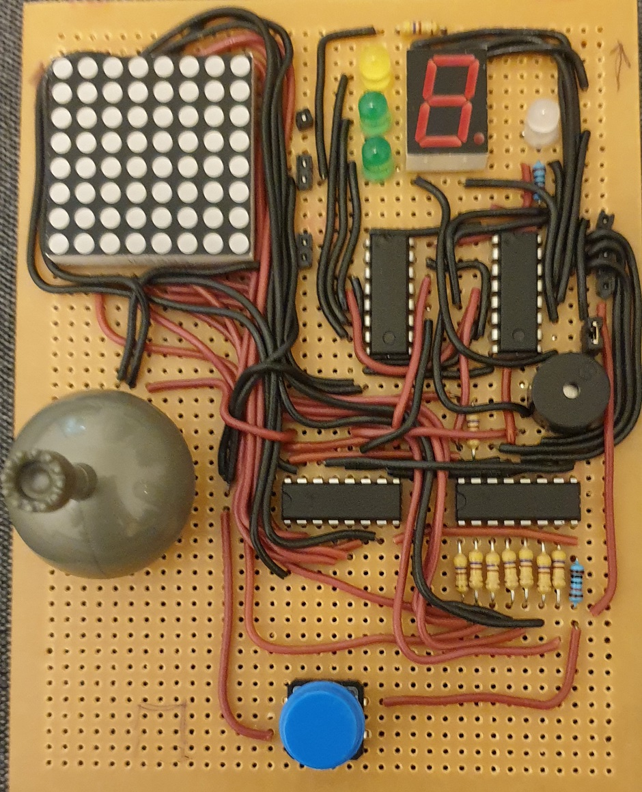

# ppGame8x8 project details

This document describes the electronic construction of this project.

## Electronic componets

- 1x Arduino Uno with with Atmega328P.
- 1x Display 1088BS, composed by 8 by 8 leds. See the [datasheet](./datasheet_1088bs_display8x8.gif).
- 3x ic 74HC595 (8-Bit Shift Registers With 3-State Output Registers). See the [datasheet](./datasheet_sn74hc595.pdf).
- 1x ic CD4511BE (CMOS BCD-to-7 segment latch decoder driver). See the [datasheet](./datasheet_cd4511be.pdf).
- 1x joystick composed by X and Y axis potentiomenters.
- 8x resistors 460 ohms.
- 1x resistor 10k ohms.
- 2x resistors 220 ohms.
- 1x normally open tactile switch.
- 1x 7 segment display with common cathode.
- 1x bicolor led red/green.

## Electric diagram

## Prototype

For testing and viability purposes we built a full prototype that runs the game and offers a good user experience. The prototype follows exactly the connections of the Electric diagram.

### Front side

### Rear side

The picture highlights the connection pins to plug in the Arduino Uno board to the rear side of the board.

### Plugging in the Arduino Uno

